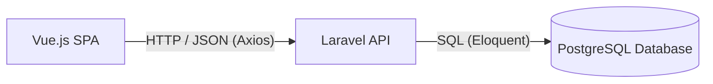

# Guía de Uso para el Desarrollo - SMU DOBLEX

Esta guía detalla la arquitectura de la aplicación, los flujos de comunicación y las pautas técnicas necesarias para extender y desarrollar nuevas funcionalidades dentro del **Sistema de Gestión de Obra Civil (SMU)**.

---

## 1. Arquitectura del Proyecto

El sistema está diseñado bajo una arquitectura desacoplada:



* **Frontend (SPA):** Servido de manera independiente. Se comunica con el backend mediante peticiones HTTPS asíncronas con Axios.
* **Backend (API REST):** Laravel actúa como una API pura. No sirve vistas Blade clásicas, sino datos estructurados en formato JSON.
* **Base de Datos:** PostgreSQL para el almacenamiento seguro e íntegro de los datos.

---

## 2. Flujo de Autenticación (Laravel Sanctum SPA)

Para proteger las rutas y autenticar a los usuarios, utilizamos la autenticación basada en cookies de **Laravel Sanctum**. Este método es el más seguro para aplicaciones SPA hospedadas en el mismo dominio o subdominios relacionados.

### Proceso de Autenticación:
1. **Petición CSRF:** Antes de que el frontend intente iniciar sesión, realiza una petición GET a `/sanctum/csrf-cookie` para obtener un token CSRF y guardarlo en las cookies del navegador.
2. **Login:** El frontend envía las credenciales (`email` y `password`) mediante POST a `/api/login`.
3. **Validación:** Laravel valida las credenciales y establece una cookie de sesión encriptada en el navegador del usuario.
4. **Peticiones Autenticadas:** Cada petición posterior enviará la cookie automáticamente gracias al parámetro `withCredentials: true` configurado en Axios.

---

## 3. Guía de Desarrollo Backend (Laravel)

### 3.1. Base de Datos y Modelos
Al crear una nueva funcionalidad, generalmente iniciamos con la estructura de datos.

1. **Crear Migración y Modelo:**
   ```bash
   php artisan make:model NombreModelo -m
   ```
   *Esto creará el archivo del modelo en `app/Models/` y el archivo de migración en `database/migrations/`.*

2. **Definir la Migración:**
   En la migración, define los campos de la tabla de forma estricta. Utiliza tipos de datos adecuados de PostgreSQL.
   ```php
   Schema::create('ordenes_trabajo', function (Blueprint $table) {
       $table->id();
       $table->string('code')->unique();
       $table->string('description');
       $table->string('location');
       $table->string('manager');
       $table->integer('progress')->default(0);
       $table->enum('status', ['pendiente', 'en_progreso', 'finalizado'])->default('pendiente');
       $table->date('start_date');
       $table->timestamps();
   });
   ```

3. **Ejecutar Migraciones:**
   ```bash
   php artisan migrate
   ```

### 3.2. Controladores y Rutas API
1. **Crear Controlador API:**
   ```bash
   php artisan make:controller Api/OrdenTrabajoController --api
   ```
   *El flag `--api` omite los métodos de renderizado de vistas (`create`, `edit`).*

2. **Definir Métodos del Controlador:**
   Escribe la lógica del negocio retornando respuestas JSON estandarizadas.
   ```php
   use App\Models\OrdenTrabajo;
   use Illuminate\Http\Request;

   public function index()
   {
       // Selección explícita de campos y optimización
       $ots = OrdenTrabajo::select('id', 'code', 'description', 'location', 'manager', 'progress', 'status', 'start_date')
           ->orderBy('created_at', 'desc')
           ->get();

       return response()->json($ots);
   }
   ```

3. **Registrar Rutas:**
   Registra los endpoints en [routes/api.php](file:///c:/Users/Admin/Documents/DEV/DOBLEX/backend/routes/api.php).
   ```php
   use App\Http\Controllers\Api\OrdenTrabajoController;

   Route::middleware('auth:sanctum')->group(function () {
       Route::apiResource('ots', OrdenTrabajoController::class);
   });
   ```

---

## 4. Guía de Desarrollo Frontend (Vue.js)

### 4.1. Consumir Endpoints de la API
Utiliza el cliente Axios configurado en [client.js](file:///c:/Users/Admin/Documents/DEV/DOBLEX/frontend/src/api/client.js), el cual ya tiene configurados los headers necesarios y el parámetro `withCredentials: true`.

**Ejemplo de Servicio en Vue:**
```javascript
import client, { getCsrfCookie } from '@/api/client';

export const OtsService = {
  // Obtener todas las OTs
  async getAll() {
    const response = await client.get('/ots');
    return response.data;
  },

  // Crear una nueva OT
  async create(data) {
    // Si es una petición de autenticación o mutación inicial, asegurar CSRF
    // await getCsrfCookie(); 
    const response = await client.post('/ots', data);
    return response.data;
  }
};
```

### 4.2. Crear una Vista (View) o Componente
1. Crea tu archivo `.vue` en `src/views/` (páginas principales de ruta) o `src/components/` (widgets y piezas reutilizables).
2. Usa la sintaxis de **Composition API** (recomendada para Vue 3):
   ```html
   <template>
     <div class="glass-panel main-panel">
       <h2>Listado de Órdenes</h2>
       <!-- Contenido -->
     </div>
   </template>

   <script setup>
   import { ref, onMounted } from 'vue';
   import { OtsService } from '@/services/OtsService';

   const ots = ref([]);
   const loading = ref(true);

   onMounted(async () => {
     try {
       ots.value = await OtsService.getAll();
     } catch (error) {
       console.error("Error cargando OTs:", error);
     } finally {
       loading.value = false;
     }
   });
   </script>
   ```

### 4.3. Agregar una Ruta en el Frontend
Si creas una nueva página, debes registrarla en [index.js](file:///c:/Users/Admin/Documents/DEV/DOBLEX/frontend/src/router/index.js):
```javascript
{
    path: '/materiales',
    name: 'materiales',
    component: () => import('../views/MaterialesView.vue'), // Lazy loading
    meta: { requiresAuth: true }
}
```

---

## 5. Reglas de Oro para el Desarrollo

Para asegurar la calidad y consistencia del proyecto, todos los desarrolladores deben adherirse a las siguientes directrices:

* **Idioma:** Todo el código fuente (nombres de variables, clases, métodos), la documentación y los comentarios deben escribirse en **Español**.
* **Base de Datos Segura:** Queda estrictamente prohibido realizar consultas crudas sin parametrizar. Usa siempre **Eloquent ORM** o el **Query Builder** con parámetros enlazados para evitar inyecciones SQL.
* **Diseño UI Consistente:** No utilices utilidades CSS ad-hoc ni frameworks adicionales como TailwindCSS sin previa autorización. Toda la interfaz debe ser responsiva y estilizada a través de las variables CSS nativas definidas en [index.css](file:///c:/Users/Admin/Documents/DEV/DOBLEX/frontend/src/index.css).
* **Gestión de Excepciones:** Tanto en Laravel como en Vue, implementa bloques `try/catch` para manejar errores de forma elegante sin exponer detalles técnicos sensibles al usuario final.
